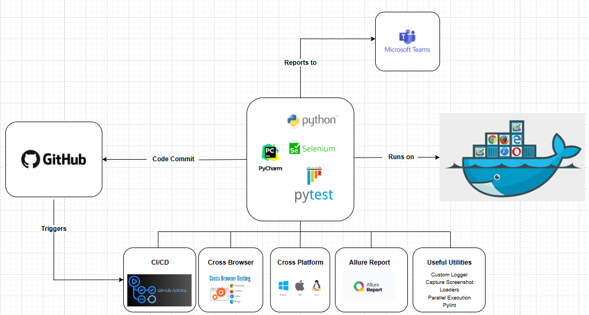

# 🧪 Selenium-Python-Automation-Framework

A scalable and maintainable test automation framework built with Python, leveraging Selenium WebDriver, Pytest, and Pytest-BDD.
It supports both UI and API test automation, with environment-driven configuration for flexibility.
The framework is fully integrated with Docker for containerized execution, GitHub Actions for CI/CD pipelines, and Microsoft Teams for real-time execution notifications.



---
## Features
- 🎭 Selenium-Python-Pytest Test Automation framework - Done
- 🔧 Python programming support - Done
- 🌐 Cross-browser UI Automation testing (Chrome, Firefox, Edge) - Done
- 🧪 API testing support with Requests library - Done
- 📊 HTML and Allure test reports - Done
- 🎯 Auto-wait, parallel execution and retry mechanisms - Done
- 🔧 CI/CD integration with Jenkins - Planned and GitHub Actions - Done
- 📥 Docker containerization - Done
- 📢 Microsoft Teams notifications - Done
- 🧩 BDD support with Pytest-BDD - Done
- 📂 Data-driven testing with JSON and Excel - Done
- 🗂️ Page Object Model (POM) design pattern - Done
- 🧑‍💻 Custom logging and screenshot capture on failures - Done
- ⚙️ Environment-driven configuration management - Done
- 🎥 Screen capture and Video recording of failed UI tests - Done
- 📱 Mobile testing support with Appium - Planned
- 🧪 Performance testing integration with Locust - Planned
- 🧑‍💻 Data Testing - Planned

---
## ⚡ Quick Setup

1. **Clone the repository:**
   ```bash
   git clone https://github.com/vishruth143/Selenium-Python-Automation-Framework.git
   cd Selenium-Python-Automation-Framework
   ```
2. **Install Python dependencies:**
   ```bash
   pip install -r requirements.txt
   ```
3. **Set environment variables:**
   ```bash
   # Example for UI and API test
   $env:APP_NAME="PTA"
   $env:SERVICE_NAME="REQRES"
   $env:REGION="QA"
   $env:BROWSER="CHROME"
   $env:HEADLESS="N"
   ```
4. **Run tests:**
   ```bash
   pytest -vvv -m "pta or reqres" -n 4 --reruns 3 --html=output/reports/pta_report.html --alluredir=output/allure-results --self-contained-html --capture=tee-sys --durations=10 tests
   ```
5. **Generate Allure report:**
   ```bash
   allure generate output/allure-results --clean -o output/allure-report
   ```
6. **View HTML/Allure report:**
   - Open `output/reports/pta_report.html` in browser
   - Or serve Allure report:
     ```bash
     python -m http.server 8000
     # Visit http://localhost:8000/output/allure-report
     ```
---
## 🚀 Project Folder Structure
```
Selenium-Python-Automation-Framework/
├── .github/
│   └── workflows/
│       └── ci.yml                                          # GitHub Actions CI workflow
│
├── config/                                                 # Configuration files
│   ├── api/
│   │   └── commerce_tools/
│   │   │    ├── api_test_data_config.json                  # COMMERCE_TOOLS API test data
│   │   │    └── api_test_env_config.yml                    # COMMERCE_TOOLS API environment config
│   │   │
│   │   └── reqres/
│   │       ├── api_test_data_config.json                   # REQRES API test data
│   │       └── api_test_env_config.yml                     # REQRES API environment config
│   │
│   ├── ui/
│   │   └── pta/
│   │       ├── ui_test_data_config.yml                     # UI test data
│   │       ├── ui_test_env_config.yml                      # UI environment config
│   │       ├── ui_test_excel_data_config.xlsx              # Excel input data
│   │       └── ui_test_excel_data_config_output.xlsx       # Excel output
│   │
│   ├── common_config.yml                                   # Shared config
│   └── config_parser.py                                    # Centralized config parser
│
├── framework/                                              # Core framework
│   ├── interfaces/
│   │   ├── __init__.py
│   │   └── api_client.py                                   # API client wrapper
│   │
│   ├── listeners/
│   │   ├── __init__.py
│   │   └── event_listeners.py                              # Event hooks (e.g., for Selenium)
│   │
│   ├── pages/
│   │   ├── __init__.py
│   │   └── base_page.py                                    # Common page object base class
│   │
│   ├── utilities/                                          # Utility functions
│   │   ├── __init__.py
│   │   ├── common.py                                       # General helpers
│   │   ├── custom_logger.py                                # Logger setup
│   │   ├── loaders.py                                      # Data/config loaders
│   │   ├── screenshot_utils.py                             # Screenshot helper
│   │   └── screen_recording_utils.py                       # Screen recording helper
│   │
│   └── __init__.py
│
│   ├── output/                                             # Output directory
│   │   ├── allure-results/                                 # Allure results directory
│   │   ├── logs                                            # Log files directory
│   │       └── test_execution.log                          # Execution log file
│   │   ├── reports/                                        # Reports directory
│   │   ├── screenshots/                                    # Screenshots directory
│
├── tests/                                                  # Test suite
│   ├── api/
│   │   └── commerce_tools/
│   │   │   ├── __init__.py
│   │   │   └── test_commerce_tools.py                      # API test cases for Commerce Tools
│   │   └── reqres/
│   │   │   ├── __init__.py
│   │   │   └── test_reqres.py                              # API test cases for Reqres
│   │   ├── __init__.py
│   │   └── conftest.py                                     # API-specific fixtures
│   │
│   ├── snippet/                                            # Code snippets for reuse
│   │   ├── __init__.py
│   │   ├── test_excel.py                                   # Excel data handling snippet
│   │   ├── test_parametrize_mechanism.py                   # Parametrization snippet
│   │   └── test_retry_mechanism.py                         # Retry mechanism snippet
│   │
│   ├── ui/
│   │   └── pta/
│   │       ├── features/
│   │       │   ├── pta_app.feature                         # Gherkin feature file for PTA
│   │       ├── pages/
│   │       │   ├── __init__.py
│   │       │   └── contact_page.py                         # Page object for contact page
│   │       │   └── home_page.py                            # Page object for home page
│   │       │   └── login_page.py                           # Page object for login page
│   │       ├── steps/
│   │       │   ├── __init__.py
│   │       │   └── test_pta_app.py                         #  Step definitions for PTA
│   │       ├── __init__.py
│   │       └── test_pta.py                                 # PTA functional tests
│   │   ├── __init__.py
│   │   └── conftest.py                                     # UI-specific fixtures
│   │
│   ├── __init__.py
│   └── conftest.py                                         # Root-level fixtures
│
├── .gitignore                                              # Files to ignore in git
├── architecture_diagram.png                                # Framework architecture diagram
├── Dockerfile                                              # Docker container setup
├── pytest.ini                                              # Pytest configuration
├── README.md                                               # Framework documentation
├──requirements.txt                                         # Python dependencies
└── UI API Automation Architecture.drawio                   # Draw.io diagram file
```
---
## 🚀 Environment Variables

### 🔹 UI Testing
| Variable    | Description                                                   | Default Value | Required/Optional |
|-------------|---------------------------------------------------------------|---------------|-------------------|
| `APP_NAME`  | Short name of application under test (AUT)                    | `None`        | `Required`        | 
| `REGION`    | Target region/environment (e.g., `QA`, `DEV`, `STAGE`,`PROD`) | `QA`          | `Optional`        | 
| `BROWSER`   | Browser to run tests on (`CHROME`, `FIREFOX`, `EDGE`)         | `CHROME`      | `Optional`        |
| `HEADLESS`  | Run in headless mode (`Y` or `N`)                             | `N`           | `Optional`        |

### 🔹 API Testing
| Variable       | Description                                                   | Default | Required/Optional |
|----------------|---------------------------------------------------------------|---------|-------------------|
| `SERVICE_NAME` | Short name of service under test (AUT)                        | `None`  | `Required`        |
| `REGION`       | Target region/environment (e.g., `QA`, `DEV`, `STAGE`,`PROD`) | `QA`    | `Optional`        |

---
### Explanation of Flags
| Variable                | Description                                                            |
|-------------------------|------------------------------------------------------------------------|
| `-v`                    | Verbose output (shows test names and status)                           |
| `-vv`                   | More verbose output (adds captured output, fixture info, etc.)         |
| `-vvv`                  | Most verbose output (adds internal debug logs, detailed fixture steps) |
| `-m <expression>`       | Run tests matching the given marker expression (e.g., `pta or reqres`) |
| `--html=...`            | Save HTML report to specified path                                     |
| `--self-contained-html` | Embed CSS/JS into the report (no external files)                       |
| `--capture=tee-sys`     | Shows print() and log output in both terminal & HTML report            |
| `--durations=10`        | Shows top 10 slowest tests (for optimization)                          |
| `--maxfail=1`           | Stop after first failure                                               |
| `--disable-warnings`    | Disable warning output                                                 |
| `--log-cli-level=INFO`  | Set log level for console output (e.g., DEBUG, INFO, WARNING, ERROR)   |
| `-n 4`                  | Run tests in parallel using 4 CPU cores                                |
| `--reruns 3`            | Rerun failed tests up to 3 times                                       |
| `tests`                 | Path to your test suite root                                           | 

---
## 🖥️ Running Tests from Command Line (PowerShell)
```bash
    $env:APP_NAME="PTA"
    $env:SERVICE_NAME="REQRES"
    $env:REGION="QA"
    $env:BROWSER="CHROME"
    $env:HEADLESS="N"
    pytest -vvv -m "pta or reqres" -n 4 --maxfail=1 --log-cli-level=INFO --reruns 3 --html=output/reports/report.html --alluredir=output/allure-results --self-contained-html --capture=tee-sys --durations=10 tests
```
```bash
    $env:SERVICE_NAME="COMMERCE_TOOLS"
    $env:REGION="qa"    
    pytest -vvv -m "commerce_tools" -n 4 --maxfail=1 --log-cli-level=INFO --reruns 3 --html=output/reports/report.html --alluredir=output/allure-results --self-contained-html --capture=tee-sys --durations=10 tests
```
---
## 🖥️ To see all the environment variables currently set, you can run:
```bash
  Get-ChildItem Env:
```
or
```bash
  gci env:
```
---
## 🖥️ If you want to filter and see only the ones you set (APP_NAME, SERVICE_NAME, etc.), you can do:
```bash
    Get-ChildItem Env: | Where-Object { $_.Name -in @("APP_NAME","SERVICE_NAME","REGION","BROWSER","HEADLESS") }
```   
---
## 🐳 To run on docker container: (PowerShell)

    # To build docker image
    docker build -t selenium-python-automation .
    
    # To run on Chrome browser
    docker run -e APP_NAME=PTA -e SERVICE_NAME=REQRES -e REGION=qa -e BROWSER=CHROME -e HEADLESS=Y selenium-python-automation pytest -vvv -m "pta or reqres" -n 4 --maxfail=1 --log-cli-level=INFO --reruns 3 --html=output/reports/report.html --alluredir=output/allure-results --self-contained-html --capture=tee-sys --durations=10 tests
    
    # To run on Firefox browser
    docker run -e APP_NAME=PTA -e SERVICE_NAME=REQRES -e REGION=qa -e BROWSER=FIREFOX -e HEADLESS=Y selenium-python-automation pytest -vvv -m "pta or reqres" -n 4 --maxfail=1 --log-cli-level=INFO --reruns 3 --html=output/reports/report.html --alluredir=output/allure-results --self-contained-html --capture=tee-sys --durations=10 tests
    
    # To run on Edge browser
    docker run -e APP_NAME=PTA -e SERVICE_NAME=REQRES -e REGION=qa -e BROWSER=EDGE -e HEADLESS=Y selenium-python-automation pytest -vvv -m "pta or reqres" -n 4 --maxfail=1 --log-cli-level=INFO --reruns 3 --html=output/reports/report.html --alluredir=output/allure-results --self-contained-html --capture=tee-sys --durations=10 tests

---
## 🖥️ To generate Allure Results
    pytest --alluredir=output/allure-results tests
    
    # To install allure run the below commands in powershell
    Set-ExecutionPolicy RemoteSigned -scope CurrentUser
    iwr -useb get.scoop.sh | iex
    scoop install allure    
    
    # To generate Allure Report
    allure generate output/allure-results --clean -o output/allure-report
---
## 🖥️ CI / CD
    Any changes made and commit to the
    Folder files i.e. '.gihub', 'config', 'framework', 'tests' 
    or
    Files i.e. 'Dockerfile', 'pytest.ini' 
    or 
    merge any branch to the main branch the git hub action will trigger and build the project.

    After the pipeline ran we can download the allure-report as artifact from the 
    github actions

    To view the allure report extract the downloaded 'allure-report.zip' and git 
    bash to the folder
    python -m http.server 8000
    http://localhost:8000    
---
## 🖥️ Notification to MS Team
### On MS Teams
```text
1. Create a Team with Channel in MS Team.
2. Click on the ... beside the channel you want the notifications to be sent and select 'Manage channel'.
3. Under 'Connectors' section Click 'Edit'.
4. Search for 'Incoming Webhook' and click 'Add'.
5. Provide the name for the 'Incoming Webhook' and click on 'Create'.
6. Copy the Webhook URL.
```

### On GitHub
```text
1. Go to your workflow and click on the Settings.
2. On the left side panel under 'Secrets and variables' click on 'Actions'.
3. Click on the 'New repository secret'.
4. Provide Name=TEAMS_WEBHOOK_URL Secret="<Webhook URL from the MS Teams>".
5. Click on 'Add secret'.
```

### Screen Recording for failed UI tests
```text
1. Download and Install ffmpeg from: https://ffmpeg.org/download.html
2. For Windows, click on the “Windows” logo and choose a build (e.g., from gyan.dev or BtbN).
3. Download the “release full” zip file.
4. Extract the zip file and add the bin folder to your system PATH i.e. C:\ffmpeg\bin
5. Verify the installation by running `ffmpeg -version` in your command prompt.
```

# 🎭 Happy testing! 🎭