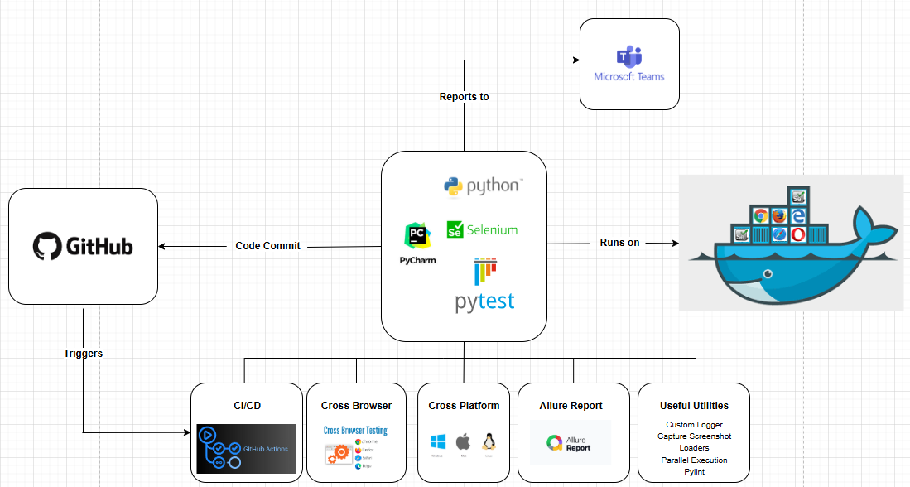

# 🧪 Selenium-Python-Automation-Framework

A scalable and maintainable test automation framework built with Python, leveraging Selenium WebDriver, Pytest, Pytest-BDD and Appium-Python-Client.
It supports both UI, API and Mobile test automation, with environment-driven configuration for flexibility.
The framework is fully integrated with Docker for containerized execution, GitHub Actions for CI/CD pipelines, and Microsoft Teams for real-time execution notifications.



---
## Features
- 🎭 Selenium-Python-Pytest Test Automation framework - Done
- 🔧 Python programming support - Done
- 🌐 Cross-browser UI Automation testing (Chrome, Firefox, Edge) - Done
- 🧪 API testing support with Requests library - Done
- 📊 HTML and Allure test reports - Done
- 🎯 Auto-wait, parallel execution and retry mechanisms - Done
- 🔧 CI/CD integration with Jenkins - Done and GitHub Actions - Done
- 📥 Docker containerization - Done
- 📢 Microsoft Teams notifications - Done
- 🧩 BDD support with Pytest-BDD - Done
- 📂 Data-driven testing with JSON and Excel - Done
- 🗂️ Page Object Model (POM) design pattern - Done
- 🧑‍💻 Custom logging and screenshot capture on failures - Done
- ⚙️ Environment-driven configuration management - Done
- 🎥 Screen capture and Video recording of failed UI tests - Done
- 📱 Mobile testing support with Appium - Done
- 🧪 Performance testing integration with Locust - Planned
- 🧑‍💻 Data Testing - Planned

---
## ⚡ Quick Setup

1. **Clone the repository:**
   ```bash
   git clone https://github.com/vishruth143/Selenium-Python-Automation-Framework.git
   cd Selenium-Python-Automation-Framework
   ```
2. **Install Python dependencies:**
   ```bash
   pip install -r requirements.txt
   ```
3. **Set environment variables:**
   ```bash
   # Example for UI and API test
   $env:APP_NAME="PTA"
   $env:MOBILE_APP_NAME="KWA"
   $env:SERVICE_NAME="REQRES"
   $env:REGION="QA"
   $env:BROWSER="CHROME"
   $env:HEADLESS="N"
   ```
4. **Run tests:**
   ```bash
   pytest -vvv -m "pta or reqres" -n 4 --reruns 3 --html=output/reports/pta_report.html --alluredir=output/allure-results --self-contained-html --capture=tee-sys --durations=10 tests
   ```
5. **Generate Allure report:**
   ```bash
   allure generate output/allure-results --clean -o output/allure-report
   ```
6. **View HTML/Allure report:**
   - Open `output/reports/pta_report.html` in browser
   - Or serve Allure report:
     ```bash
     python -m http.server 8000
     # Visit http://localhost:8000/output/allure-report
     ```
---
## 🚀 Project Folder Structure
```
Selenium-Python-Automation-Framework/
├── .github/
│   └── workflows/
│       └── ci.yml                                          # GitHub Actions CI workflow
│
├── config/                                                 # Configuration files
│   ├── api/
│   │   └── commerce_tools/
│   │   │    ├── api_test_data_config.json                  # COMMERCE_TOOLS API test data
│   │   │    └── api_test_env_config.yml                    # COMMERCE_TOOLS API environment config
│   │   │
│   │   └── reqres/
│   │       ├── api_test_data_config.json                   # REQRES API test data
│   │       └── api_test_env_config.yml                     # REQRES API environment config
│   │
│   ├── mobile/
│   │   └── kwa/
│   │       ├── mobile_test_data_config.yml                 # Mobile test data
│   │       └── mobile_test_env_config.yml                  # Mobile environment config
│   │
│   ├── ui/
│   │   ├── hirokuapp/
│   │   │   ├── ui_test_data_config.yml                     # Herokuapp UI test data
│   │   │   └── ui_test_env_config.yml                      # Herokuapp UI environment config
│   │   │
│   │   └── pta/
│   │       ├── ui_test_data_config.yml                     # PTA UI test data
│   │       ├── ui_test_env_config.yml                      # PTA UI environment config
│   │       ├── ui_test_excel_data_config.xlsx              # Excel input data
│   │       └── ui_test_excel_data_config_output.xlsx       # Excel output
│   │
│   ├── common_config.yml                                   # Shared config
│   └── config_parser.py                                    # Centralized config parser
│
├── framework/                                              # Core framework
│   ├── interfaces/
│   │   ├── __init__.py
│   │   └── api_client.py                                   # API client wrapper
│   │
│   ├── listeners/
│   │   ├── __init__.py
│   │   └── event_listeners.py                              # Event hooks (e.g., for Selenium)
│   │
│   ├── pages/
│   │   ├── __init__.py
│   │   └── base_page.py                                    # Common page object base class
│   │
│   ├── utilities/                                          # Utility functions
│   │   ├── __init__.py
│   │   ├── common.py                                       # General helpers
│   │   ├── custom_logger.py                                # Logger setup
│   │   ├── emulator_launcher.py                            # Mobile emulator helper
│   │   ├── loaders.py                                      # Data/config loaders
│   │   ├── screen_recording_utils.py                       # Screen recording helper
│   │   └── screenshot_utils.py                             # Screenshot helper
│   │
│   └── __init__.py
│
│   ├── output/                                             # Output directory
│   │   ├── allure-results/                                 # Allure results directory
│   │   ├── logs                                            # Log files directory
│   │   │   └── test_execution.log                          # Execution log file
│   │   ├── reports/                                        # Reports directory
│   └── └── screenshots/                                    # Screenshots directory
│          
├── tests/                                                  # Test suite
│   ├── api/
│   │   └── commerce_tools/
│   │   │   ├── __init__.py
│   │   │   └── test_commerce_tools.py                      # API test cases for Commerce Tools
│   │   └── reqres/
│   │   │   ├── __init__.py
│   │   │   └── test_reqres.py                              # API test cases for Reqres
│   │   ├── __init__.py
│   │   └── conftest.py                                     # API-specific fixtures
│   │
│   ├── mobile/
│   │   └── kwa/
│   │       ├── pages/
│   │       │   ├── __init__.py
│   │       │   └── contact_us_form_page.py                 # Page object for contact us form page
│   │       │   └── enter_some_value_page.py                # Page object for enter some value page
│   │       │   └── home_page.py                            # Page object for home page
│   │       ├── __init__.py
│   │       └── test_kwa.py                                 # KWA functional tests
│   │   ├── __init__.py
│   │   └── conftest.py                                     # MOBILE-specific fixtures
│   │
│   ├── snippet/                                            # Code snippets for reuse
│   │   ├── __init__.py
│   │   ├── test_excel.py                                   # Excel data handling snippet
│   │   ├── test_parametrize_mechanism.py                   # Parametrization snippet
│   │   └── test_retry_mechanism.py                         # Retry mechanism snippet
│   │
│   ├── ui/
│   │   ├── hirokuapp/
│   │   │   ├── pages/
│   │   │   │   ├── __init__.py
│   │   │   │   ├── landing_page.py                         # Page object for the Herokuapp landing page
│   │   │   │   ├── ab_test_page.py                         # Page object for the A/B Testing page
│   │   │   │   ├── add_remove_elements_page.py             # Page object for the Add/Remove Elements page
│   │   │   │   ├── basic_auth_page.py                      # Page object for the Basic Auth page
│   │   │   │   └── broken_images_page.py                   # Page object for the Broken Images page
│   │   │   ├── __init__.py
│   │   │   └── test_hirokuapp.py                           # Herokuapp functional tests (broken links, A/B test, add/remove elements, basic auth, broken images)
│   │   │
│   │   └── pta/
│   │       ├── features/
│   │       │   ├── pta_app.feature                         # Gherkin feature file for PTA
│   │       ├── pages/
│   │       │   ├── __init__.py
│   │       │   └── contact_page.py                         # Page object for contact page
│   │       │   └── home_page.py                            # Page object for home page
│   │       │   └── login_page.py                           # Page object for login page
│   │       ├── steps/
│   │       │   ├── __init__.py
│   │       │   └── test_pta_app.py                         # Step definitions for PTA
│   │       ├── __init__.py
│   │       ├── test_pta_clean_version.py                   # PTA functional tests with minimal comments for experienced testers
│   │       └── test_pta_tutorial_version.py                # PTA functional tests with tutorial like comments
│   │   ├── __init__.py
│   │   └── conftest.py                                     # UI-specific fixtures
│   │
│   ├── __init__.py
│   └── conftest.py                                         # Root-level fixtures
│
├── .gitignore                                              # Files to ignore in git
├── architecture_diagram.png                                # Framework architecture diagram
├── Dockerfile                                              # Docker container setup
├── Jenkinsfile                                             # Jenkins CI pipeline
├── pytest.ini                                              # Pytest configuration
├── README.md                                               # Framework documentation
├──requirements.txt                                         # Python dependencies
└── UI API Automation Architecture.drawio                   # Draw.io diagram file
```
---
## 🚀 Environment Variables

### 🔹 UI Testing
| Variable    | Description                                                   | Default Value | Required/Optional |
|-------------|---------------------------------------------------------------|---------------|-------------------|
| `APP_NAME`  | Short name of application under test (AUT) (`PTA`, `HIROKUAPP`) | `None`      | `Required`        | 
| `REGION`    | Target region/environment (e.g., `QA`, `DEV`, `STAGE`,`PROD`) | `QA`          | `Optional`        | 
| `BROWSER`   | Browser to run tests on (`CHROME`, `FIREFOX`, `EDGE`)         | `CHROME`      | `Optional`        |
| `HEADLESS`  | Run in headless mode (`Y` or `N`)                             | `N`           | `Optional`        |

### 🔹 API Testing
| Variable       | Description                                                   | Default | Required/Optional |
|----------------|---------------------------------------------------------------|---------|-------------------|
| `SERVICE_NAME` | Short name of service under test (AUT)                        | `None`  | `Required`        |
| `REGION`       | Target region/environment (e.g., `QA`, `DEV`, `STAGE`,`PROD`) | `QA`    | `Optional`        |

---
### Explanation of Flags
| Variable                | Description                                                            |
|-------------------------|------------------------------------------------------------------------|
| `-v`                    | Verbose output (shows test names and status)                           |
| `-vv`                   | More verbose output (adds captured output, fixture info, etc.)         |
| `-vvv`                  | Most verbose output (adds internal debug logs, detailed fixture steps) |
| `-m <expression>`       | Run tests matching the given marker expression (e.g., `pta or reqres`) |
| `--html=...`            | Save HTML report to specified path                                     |
| `--self-contained-html` | Embed CSS/JS into the report (no external files)                       |
| `--capture=tee-sys`     | Shows print() and log output in both terminal & HTML report            |
| `--durations=10`        | Shows top 10 slowest tests (for optimization)                          |
| `--maxfail=1`           | Stop after first failure                                               |
| `--disable-warnings`    | Disable warning output                                                 |
| `--log-cli-level=INFO`  | Set log level for console output (e.g., DEBUG, INFO, WARNING, ERROR)   |
| `-n 4`                  | Run tests in parallel using 4 CPU cores                                |
| `--reruns 3`            | Rerun failed tests up to 3 times                                       |
| `tests`                 | Path to your test suite root                                           | 

---
## 🖥️ Running UI Tests from Command Line (PowerShell)
```bash
    $env:APP_NAME="PTA"
    $env:REGION="QA"
    $env:BROWSER="CHROME"
    $env:HEADLESS="N"
    pytest -vvv -m "pta or reqres" -n 4 --maxfail=1 --log-cli-level=INFO --reruns 3 --html=output/reports/report.html --alluredir=output/allure-results --self-contained-html --capture=tee-sys --durations=10 tests
```

## 🖥️ Running Herokuapp Tests from Command Line (PowerShell)
```bash
    $env:APP_NAME="HIROKUAPP"
    $env:REGION="QA"
    $env:BROWSER="CHROME"
    $env:HEADLESS="N"
    pytest -vvv -m "hirokuapp" --maxfail=1 --log-cli-level=INFO --reruns 3 --html=output/reports/hirokuapp_report.html --alluredir=output/allure-results --self-contained-html --capture=tee-sys --durations=10 tests
```

## 🖥️ Running API Tests from Command Line (PowerShell)
```bash
    $env:SERVICE_NAME="COMMERCE_TOOLS"
    $env:REGION="qa"    
    pytest -vvv -m "commerce_tools" -n 4 --maxfail=1 --log-cli-level=INFO --reruns 3 --html=output/reports/report.html --alluredir=output/allure-results --self-contained-html --capture=tee-sys --durations=10 tests
```
## 🖥️ Running Mobile Tests from Command Line (PowerShell)
```bash
    $env:MOBILE_APP_NAME="KWA"       
    pytest -vvv -m "kwa" --maxfail=1 --log-cli-level=INFO --reruns 3 --html=output/reports/report.html --alluredir=output/allure-results --self-contained-html --capture=tee-sys --durations=10 tests
```
---
## 🖥️ To see all the environment variables currently set, you can run:

**PowerShell:**
```powershell
Get-ChildItem Env:
# or shorthand
gci env:
```

**Bash (Git Bash / Linux / macOS):**
```bash
env
# or
printenv
```

**CMD (Command Prompt):**
```cmd
set
```
---
## 🖥️ If you want to filter and see only the ones you set (APP_NAME, SERVICE_NAME, etc.), you can do:

**PowerShell:**
```powershell
Get-ChildItem Env: | Where-Object { $_.Name -in @("APP_NAME","SERVICE_NAME", "MOBILE_APP_NAME", "REGION","BROWSER","HEADLESS") }
```

**Bash (Git Bash / Linux / macOS):**
```bash
env | grep -E "^(APP_NAME|SERVICE_NAME|MOBILE_APP_NAME|REGION|BROWSER|HEADLESS)="
```   
---
## 🐳 To run on docker container: (PowerShell)

    # To build docker image
    docker build -t selenium-python-automation .
    
    # To run on Chrome browser
    docker run -e APP_NAME=PTA -e SERVICE_NAME=REQRES -e REGION=qa -e BROWSER=CHROME -e HEADLESS=Y selenium-python-automation pytest -vvv -m "pta or reqres" -n 4 --maxfail=1 --log-cli-level=INFO --reruns 3 --html=output/reports/report.html --alluredir=output/allure-results --self-contained-html --capture=tee-sys --durations=10 tests
    
    # To run on Firefox browser
    docker run -e APP_NAME=PTA -e SERVICE_NAME=REQRES -e REGION=qa -e BROWSER=FIREFOX -e HEADLESS=Y selenium-python-automation pytest -vvv -m "pta or reqres" -n 4 --maxfail=1 --log-cli-level=INFO --reruns 3 --html=output/reports/report.html --alluredir=output/allure-results --self-contained-html --capture=tee-sys --durations=10 tests
    
    # To run on Edge browser
    docker run -e APP_NAME=PTA -e SERVICE_NAME=REQRES -e REGION=qa -e BROWSER=EDGE -e HEADLESS=Y selenium-python-automation pytest -vvv -m "pta or reqres" -n 4 --maxfail=1 --log-cli-level=INFO --reruns 3 --html=output/reports/report.html --alluredir=output/allure-results --self-contained-html --capture=tee-sys --durations=10 tests

---
## 🖥️ To generate Allure Results
    pytest --alluredir=output/allure-results tests
    
    # To install allure run the below commands in powershell
    Set-ExecutionPolicy RemoteSigned -scope CurrentUser
    iwr -useb get.scoop.sh | iex
    scoop install allure    
    
    # To generate Allure Report
    allure generate output/allure-results --clean -o output/allure-report
---
## 🖥️ CI / CD
    Any changes made and commit to the
    Folder files i.e. '.gihub', 'config', 'framework', 'tests' 
    or
    Files i.e. 'Dockerfile', 'pytest.ini' 
    or 
    merge any branch to the main branch the git hub action will trigger and build the project.

    After the pipeline ran we can download the allure-report as artifact from the 
    github actions

    To view the allure report extract the downloaded 'allure-report.zip' and git 
    bash to the folder
    python -m http.server 8000
    http://localhost:8000    
---
## 🖥️ Notification to MS Team
### On MS Teams
```text
1. Create a Team with Channel in MS Team.
2. Click on the ... beside the channel you want the notifications to be sent and select 'Manage channel'.
3. Under 'Connectors' section Click 'Edit'.
4. Search for 'Incoming Webhook' and click 'Add'.
5. Provide the name for the 'Incoming Webhook' and click on 'Create'.
6. Copy the Webhook URL.
```

### On GitHub
```text
1. Go to your workflow and click on the Settings.
2. On the left side panel under 'Secrets and variables' click on 'Actions'.
3. Click on the 'New repository secret'.
4. Provide Name=TEAMS_WEBHOOK_URL Secret="<Webhook URL from the MS Teams>".
5. Click on 'Add secret'.
```

### Screen Recording for failed UI tests
```text
1. Download and Install ffmpeg from: https://ffmpeg.org/download.html
2. For Windows, click on the “Windows” logo and choose a build (e.g., from gyan.dev or BtbN).
3. Download the “release full” zip file.
4. Extract the zip file and add the bin folder to your system PATH i.e. C:\ffmpeg\bin
5. Verify the installation by running `ffmpeg -version` in your command prompt.
```

---
## 📝 Conventional Commit Message Reference

This project follows the [Conventional Commits](https://www.conventionalcommits.org/) specification for all commit messages.

### ✅ Format
```
<type>(<optional scope>): <short summary>

<optional body — explains WHAT and WHY>

<optional footer — e.g. BREAKING CHANGE, closes #issue>
```

### 🏷️ Commit Type Prefixes

| Prefix | When to use | Example |
|--------|-------------|---------|
| `feat` | A new feature is added | `feat(login): add remember-me checkbox` |
| `fix` | A bug fix | `fix(logger): release file handlers before output cleanup` |
| `chore` | Routine tasks, dependency updates, tooling — no production logic change | `chore(deps): bump selenium 4.41.0 → 4.43.0` |
| `docs` | Documentation changes only | `docs(readme): add conventional commits reference` |
| `style` | Code formatting, whitespace, missing semicolons — no logic change | `style: reformat imports in conftest.py` |
| `refactor` | Code restructured without fixing a bug or adding a feature | `refactor(common): extract login steps into helper method` |
| `test` | Adding or updating tests | `test(pta): add test_pta1.py for login flow` |
| `perf` | Performance improvement | `perf(conftest): load config once at session scope` |
| `ci` | Changes to CI/CD pipeline files (GitHub Actions, Jenkinsfile, Dockerfile) | `ci: add headless flag to GitHub Actions workflow` |
| `build` | Changes that affect the build system or external dependencies | `build: upgrade to Python 3.13` |
| `revert` | Reverts a previous commit | `revert: revert "feat(login): add remember-me checkbox"` |

### 🔍 Scope (optional)
The scope is a short noun describing the section of the codebase affected.  
Place it in parentheses after the type: `fix(conftest):`, `feat(login):`, `chore(deps):`

Common scopes used in this project:

| Scope | Refers to |
|-------|-----------|
| `deps` | `requirements.txt` dependency changes |
| `conftest` | `tests/conftest.py` or any `conftest.py` |
| `logger` | `framework/utilities/custom_logger.py` |
| `common` | `framework/utilities/common.py` |
| `config` | `config/` directory |
| `pta` | PTA UI test suite |
| `hirokuapp` | The Internet Herokuapp UI test suite |
| `reqres` | Reqres API test suite |
| `kwa` | KWA mobile test suite |
| `ci` | `.github/workflows/`, `Jenkinsfile`, `Dockerfile` |
| `readme` | `README.md` |

### ⚠️ Breaking Changes
If a commit introduces a breaking change, add `BREAKING CHANGE:` in the footer or append `!` after the type:
```
feat(config)!: rename region key from 'qa' to 'QA' in env config

BREAKING CHANGE: all config YAML files must now use uppercase region keys.
```

### 💡 Quick Examples Used in This Project

```
feat(pta): add test_pta_clean_version.py with clean login test without tutorial comments

fix(conftest): release log handlers before rmtree to fix Windows file lock

chore(deps): bump pytest 8.4.2 → 9.0.3, selenium 4.41.0 → 4.43.0, faker 40.11.1 → 40.13.0, requests 2.33.0 → 2.33.1

docs(readme): add conventional commits reference section

test(pta): add detailed tutorial comments to test_pta.py for onboarding
```

---
# 🎭 Happy testing! 🎭